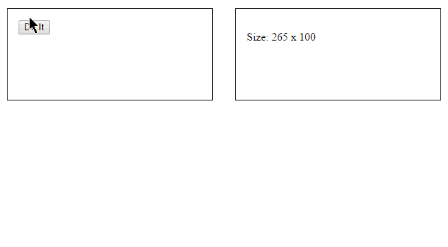

# Resize Triggering

```JavaScript
$("#myElement").resizeTriggering().on("resize", function(e){
  // Code to handle resize
});
```

## Resize event for none `window` elements
Have you ever wanted to listen for a `resize` event on an element other than `window`?
This plugin listens for a `resize` event on any element and then triggers the `resize` event using jQuery so any Event Listeners will be called. Simply call the plugin on the element before adding the resize Event Listener.

## Check Interval
The plugin works by periodically checking to see if the elements size has changed. By default it checks every 16 milliseconds (60 fps), but you can adjust this value by setting the `$.ResizeTriggeringInterval` value.
```JavaScript
$.ResizeTriggeringInterval = 1000; // Checks once every second
```

## Example



```HTML
<!DOCTYPE html>
<html>
<head>
  <script src='http://code.jquery.com/jquery-2.1.1.min.js'></script>
  <script src='src/ResizeTriggering.js'></script>
  <script>
    $(function(){
      $second = $("#second");
      $second.resizeTriggering().on("resize", function(){
        $("#size").html($second.width()+" x "+$second.height());
      });
    });
    function doIt(){
      $("#wrapper").toggleClass("doIt");
    }
  </script>
  <style>
    #wrapper {
      display: flex;
    }
    #first,
    #second {
      flex: 1;
      border: 1px solid black;
      margin: 16px;
      padding: 16px;
      height: 100px;
      transition: flex 0.5s, height 0.5s;
    }
    #wrapper.doIt #first,
    #wrapper.doIt #second {
      height: 300px;
    }
    #wrapper.doIt #first {
      flex: 3;
    }
  </style>
</head>
<body>
  <div id='wrapper'>
    <div id='first'>
      <button onclick='doIt()'>Do It</button>
    </div>
    <div id='second'>
      <p>Size: <span id='size'></span></p>
    </div>
  </div>
</body>
</html>
```